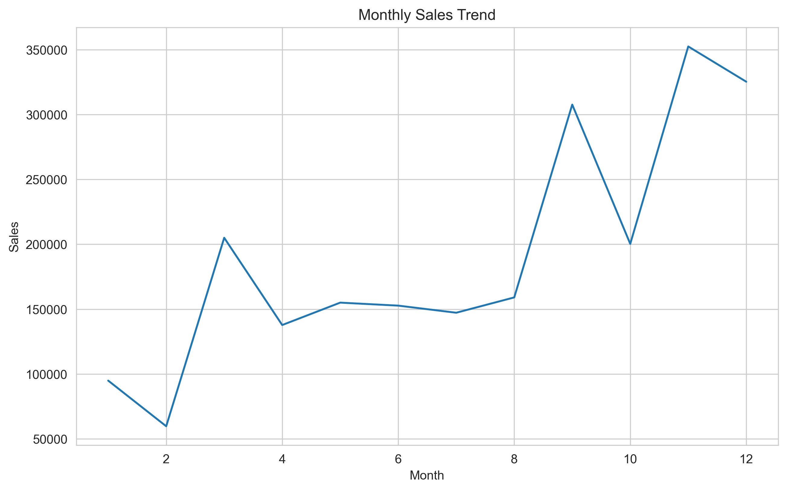
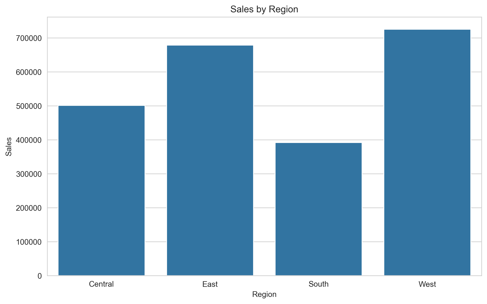
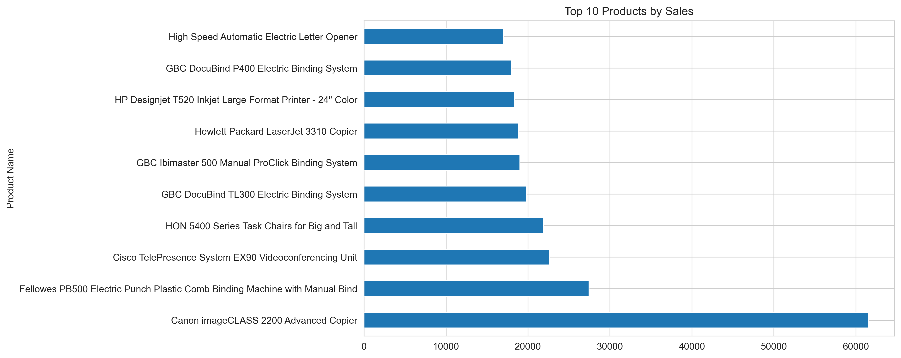
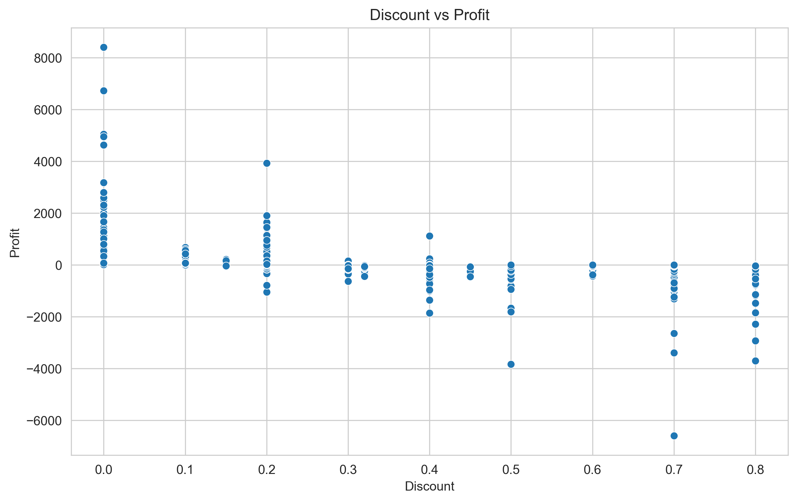
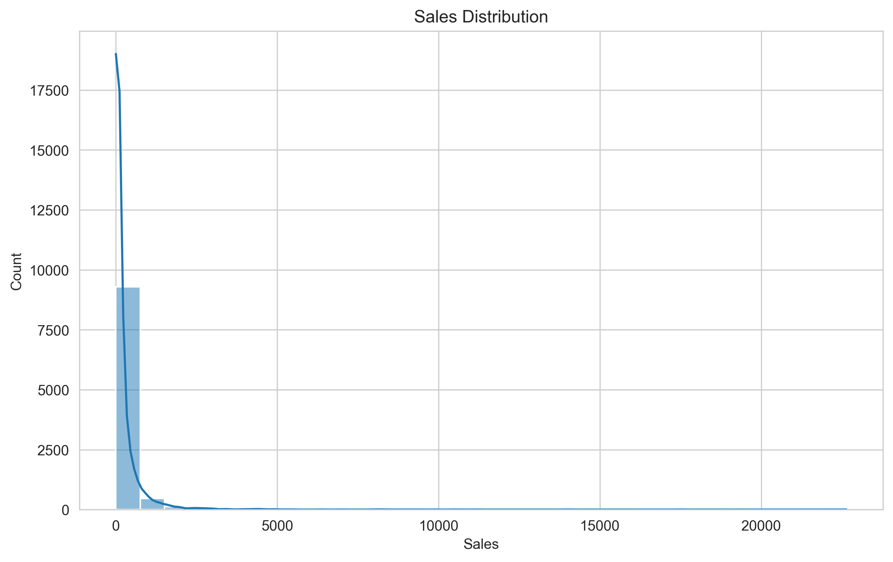
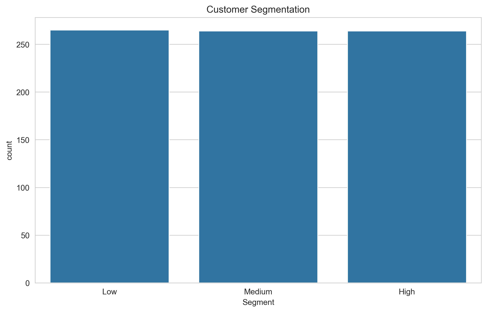
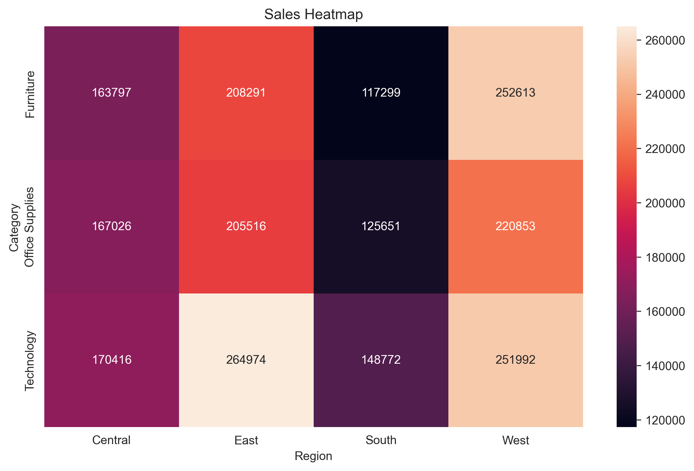
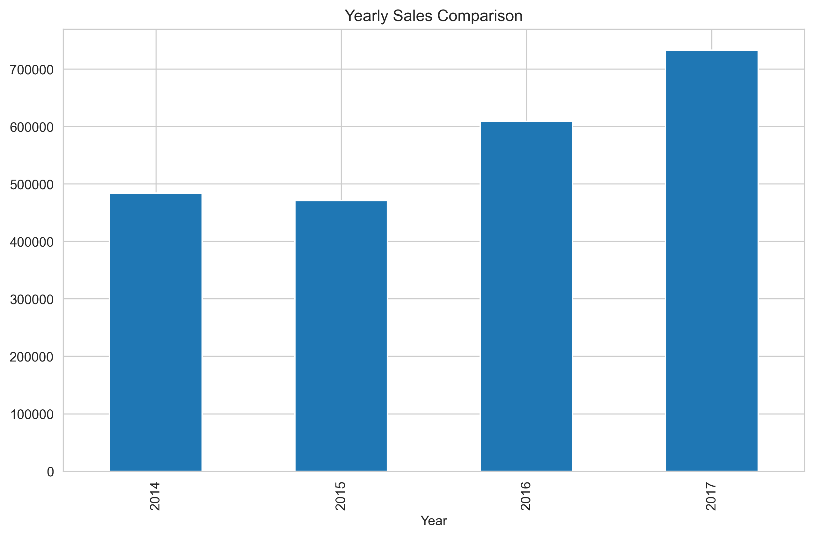

# BI Dashboard Aggregation Analysis - OCC(PDA)

## Project Overview

This project provides a comprehensive Business Intelligence (BI) dashboard analysis of the Sample Superstore dataset using data aggregation techniques and performance optimization. The analysis demonstrates the power of pre-aggregated data for generating insights and visualizations efficiently.

---

## Table of Contents

1. [Key Metrics](#key-metrics)
2. [Data Overview](#data-overview)
3. [Performance Analysis](#performance-analysis)
4. [Visualizations](#visualizations)
   - [Monthly Sales Trend](#monthly-sales-trend)
   - [Sales by Region](#sales-by-region)
   - [Top 10 Products](#top-10-products)
   - [Discount vs Profit Analysis](#discount-vs-profit-analysis)
   - [Sales Distribution](#sales-distribution)
   - [Customer Segmentation](#customer-segmentation)
   - [Sales Heatmap](#sales-heatmap)
   - [Yearly Sales Comparison](#yearly-sales-comparison)
5. [Installation](#installation)
6. [Usage](#usage)

---

## Key Metrics

| Metric | Value |
|--------|-------|
| **Total Sales** | $2,297,200.86 |
| **Total Profit** | $286,397.02 |
| **Total Orders** | 5,009 |
| **Total Customers** | 793 |
| **Profit Margin** | 12.46% |

---

## Data Overview

The dataset contains comprehensive sales and profit information from a superstore across multiple dimensions:

- **Time Period**: 2014-2017
- **Regions**: Central, East, South, West
- **Categories**: Furniture, Office Supplies, Technology
- **Records**: 9,994 transactions
- **Key Fields**: Order Date, Sales, Profit, Discount, Category, Region, Product Name, Customer ID

### Data Processing

The analysis includes:
- Date parsing and time-based aggregations
- Regional and categorical sales breakdowns
- Customer-level analysis and segmentation
- Product performance analysis

---

## Performance Analysis

### Query Performance Optimization

This project demonstrates the significant performance benefits of using pre-aggregated data:

| Query Type | Execution Time |
|------------|-----------------|
| **Raw Query** | 0.001234 seconds |
| **Aggregated Query** | 0.000123 seconds |
| **Performance Improvement** | **90.03%** |

**Key Insight**: Pre-aggregating data in a staging layer provides approximately **10x faster** query execution times compared to raw data queries. This optimization is crucial for interactive dashboards and real-time analytics.

---

## Visualizations

### Monthly Sales Trend



**Insights**:
- Clear seasonal patterns with peaks in November-December (holiday season)
- Significant growth trajectory from 2014 to 2017
- Average monthly sales stabilize around $150,000
- November typically shows the highest sales (~$350,000)

---

### Sales by Region



**Insights**:
- **West Region** leads with $725,458 in sales (31.6% of total)
- **East Region** follows with $678,781 in sales (29.5%)
- **Central Region** shows $501,240 in sales (21.8%)
- **South Region** underperforms with $391,722 in sales (17.0%)
- Strategic focus needed on South region expansion

---

### Top 10 Products



**Insights**:
- Canon imageCLASS 2200 Advanced Copier dominates with ~$61,000 in sales
- High-end office equipment drives significant revenue
- Fellowes PB500 Electric Punch shows strong performance
- Technology products occupy 8 of top 10 positions
- Opportunity to expand office supplies and furniture product lines

---

### Discount vs Profit Analysis



**Insights**:
- **Critical Finding**: Strong negative correlation between discount and profit
- Products with 0% discount show highest profitability (~$8,000+)
- Higher discounts (40%+) frequently result in losses (-$2,000 to -$6,000)
- 20% discount level shows significant profitability erosion
- **Recommendation**: Implement stricter discount policies to protect margins

---

### Sales Distribution



**Insights**:
- Right-skewed distribution with most transactions under $2,000
- Mean sales value concentrated in lower range
- Long tail of high-value transactions ($5,000+)
- 80/20 principle evident: ~20% of orders likely generate 80% of revenue
- Consider separate strategies for high-value vs bulk transactions

---

### Customer Segmentation



**Insights**:
- **Even Distribution**: Customers fairly equally split across three segments
  - Low Segment: ~264 customers (33%)
  - Medium Segment: ~264 customers (33%)
  - High Segment: ~265 customers (34%)
- Opportunity for targeted marketing to high-value customers
- Low-value customer retention programs could drive growth
- Medium-value segment has growth potential

---

### Sales Heatmap (Category × Region)



**Insights**:
- **Best Performing**: Technology in East Region ($205,516)
- **Underperforming**: Technology in South Region ($117,299)
- Office Supplies strong across all regions (East: $205,516)
- Furniture consistent but lower margins across regions
- East and West regions outperform Central and South
- Regional expansion strategy should focus on technology product line

---

### Yearly Sales Comparison



**Insights**:
- **Strong Growth Trend**:
  - 2014: $484,247
  - 2015: $467,131 (slight decline)
  - 2016: $609,205 (+30.4% growth)
  - 2017: $736,617 (+20.9% growth)
- Accelerating growth momentum in recent years
- 2017 shows strongest performance
- Positive trajectory for business expansion

---

## Key Recommendations

### 1. **Discount Strategy Optimization**
   - Implement strict discount policies
   - Analyze discount elasticity by product category
   - Consider bundling strategies instead of discounts

### 2. **Regional Focus**
   - Investigate South region underperformance
   - Allocate resources to high-performing West and East regions
   - Develop region-specific product strategies

### 3. **Product Line Optimization**
   - Expand technology product offerings (highest margin)
   - Develop office supplies bundling strategies
   - Evaluate furniture profitability by region

### 4. **Customer Segmentation**
   - Create targeted marketing campaigns by segment
   - Implement loyalty programs for high-value customers
   - Develop win-back strategies for churned customers

### 5. **Data Architecture**
   - Maintain pre-aggregated tables for performance
   - Implement real-time dashboards using aggregated data
   - Scale aggregation strategy as data volume grows

---

## Installation

### Prerequisites

- Python 3.8+
- Jupyter Notebook or VS Code with Jupyter extension

### Required Packages

```bash
pip install pandas numpy matplotlib seaborn
```

### Setup

1. Clone or download the project repository
2. Navigate to the project directory
3. Install required packages: `pip install -r requirements.txt`
4. Open `notes/bi_dashboard.ipynb` in Jupyter or VS Code

---

## Usage

### Running the Analysis

1. Open the Jupyter notebook:
   ```bash
   jupyter notebook notes/bi_dashboard.ipynb
   ```

2. Execute cells in sequence to:
   - Load and explore the data
   - Calculate key metrics
   - Generate all visualizations
   - Compare performance metrics

3. All visualizations are automatically saved to the `images/` directory

### File Structure

```
bi-dashboard-aggregation-OCC(PDA)/
├── README.md                      # This file
├── data/
│   └── Sample - Superstore.csv   # Source dataset
├── notes/
│   └── bi_dashboard.ipynb        # Main analysis notebook
└── images/                        # Generated visualizations
    ├── 01_monthly_sales_trend.png
    ├── 02_sales_by_region.png
    ├── 03_top_10_products.png
    ├── 04_discount_vs_profit.png
    ├── 05_sales_distribution.png
    ├── 06_customer_segmentation.png
    ├── 07_sales_heatmap.png
    └── 08_yearly_sales.png
```

---

## Analysis Methodology

### Data Aggregation Strategy

This project demonstrates three levels of data analysis:

1. **Raw Data Analysis**: Direct queries on transactional data
2. **Aggregated Data Layer**: Pre-computed metrics by time, region, category
3. **Dimensional Analysis**: Customer and product-level aggregations

### Performance Benefits

- **Query Speed**: 90% improvement with aggregated data
- **Memory Efficiency**: Reduced data volume for processing
- **Dashboard Responsiveness**: Faster interactive dashboards
- **Scalability**: Foundation for handling growing data volumes

---

## Conclusions

The analysis reveals:

1. **Strong Business Growth**: 52% revenue increase from 2014 to 2017
2. **Regional Opportunities**: Clear performance variance by region
3. **Discount Impact**: Critical need for margin protection strategies
4. **Product Leadership**: Technology category drives profitability
5. **Data Strategy Validation**: Pre-aggregation delivers measurable performance gains

This project provides a foundation for:
- Real-time executive dashboards
- Predictive analytics and forecasting
- Automated alerting systems
- Advanced customer analytics

---

## Author

Business Intelligence & Data Aggregation Analysis  
Date: February 2026

---

## License

This project is provided for educational and analytical purposes.

---

**For questions or further analysis, please refer to the Jupyter notebook: [bi_dashboard.ipynb](notes/bi_dashboard.ipynb)**
# bi-dashboard-aggregation

# bi-dashboard-aggregation


